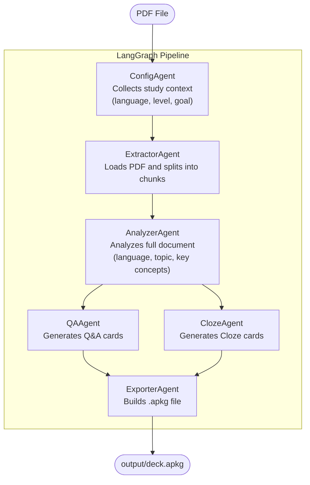

# pdf2anki

A multi-agent pipeline that reads a PDF and generates an Anki deck (`.apkg`) with Q&A and Cloze flashcards, powered by [LangChain](https://js.langchain.com/), [LangGraph](https://langchain-ai.github.io/langgraphjs/), and Google Gemini.

---

## How it works



LangGraph orchestrates the pipeline as a state graph. The `AnalyzerAgent` reads the entire document before card generation, giving `QAAgent` and `ClozeAgent` full context — even when processing individual chunks. `QAAgent` and `ClozeAgent` run in parallel.

---

## Architecture

The project follows OOP and SOLID principles. Each agent is a class implementing the `IAgent` interface.

```
src/
├── index.ts                    # CLI — class CLI
├── graph.ts                    # Pipeline orchestration — class Pipeline
├── agents/
│   ├── index.ts                # Barrel exports
│   ├── config/
│   │   └── index.ts            # class ConfigAgent
│   ├── extractor/
│   │   └── index.ts            # class ExtractorAgent
│   ├── analyzer/
│   │   ├── index.ts            # class AnalyzerAgent
│   │   ├── prompt.ts           # Document analysis prompt
│   │   └── schema.ts           # Zod output schema
│   ├── qa/
│   │   ├── index.ts            # class QAAgent
│   │   ├── prompt.ts           # Q&A generation prompt
│   │   └── schema.ts           # Zod output schema
│   ├── cloze/
│   │   ├── index.ts            # class ClozeAgent
│   │   ├── prompt.ts           # Cloze generation prompt
│   │   └── schema.ts           # Zod output schema
│   └── exporter/
│       └── index.ts            # class ExporterAgent
├── lib/
│   └── llm.ts                  # class GeminiProvider (implements ILLMProvider)
└── types/
    ├── interfaces.ts           # IAgent, ILLMProvider
    └── state.ts                # GraphState, StudyContext, DocumentSummary, card types
```

---

## Requirements

- Node.js >= 18
- Google Cloud Vertex AI service account with Gemini access

---

## Setup

**1. Install dependencies**

```bash
npm install
```

**2. Configure environment variables**

```bash
cp .env.example .env
```

Edit `.env`:

```env
GOOGLE_VERTEX_PROJECT=your-gcp-project-id
GOOGLE_VERTEX_LOCATION=us-central1
GOOGLE_APPLICATION_CREDENTIALS=./credentials.json
```

Place your service account JSON file at `credentials.json` in the project root (it is git-ignored).

**3. Run**

```bash
npm start -- ./path/to/file.pdf "Deck Name"
```

The deck name is optional — if omitted, the PDF filename is used.

You will be prompted to select the study mode before processing begins.

**4. Import into Anki**

Open Anki → `File` → `Import` → select the `.apkg` file from the `output/` folder.

---

## Study modes

| Mode | Description |
| --- | --- |
| **English learning** | Front in English, back in Portuguese with translation and explanation |
| **University** | Portuguese cards with comprehensive summaries, no information lost |
| **Custom** | Configure language, level, goal, and extra instructions manually |

---

## Card types

| Type | Description | Example |
| --- | --- | --- |
| **Q&A** | Classic front/back flashcard | Front: "What is X?" → Back: "X is..." |
| **Cloze** | Fill-in-the-blank using Anki's `{{c1::word}}` syntax | `"The capital of France is {{c1::Paris}}."` |

---

## Stack

| Layer | Technology |
| --- | --- |
| Runtime | Node.js + TypeScript |
| LLM | Google Gemini via Vertex AI |
| Agents | LangChain.js |
| Orchestration | LangGraph.js |
| PDF parsing | `@langchain/community` + `pdf-parse` |
| Deck export | `anki-apkg-export` |
| CLI prompts | `prompts` |

---

## License

MIT
